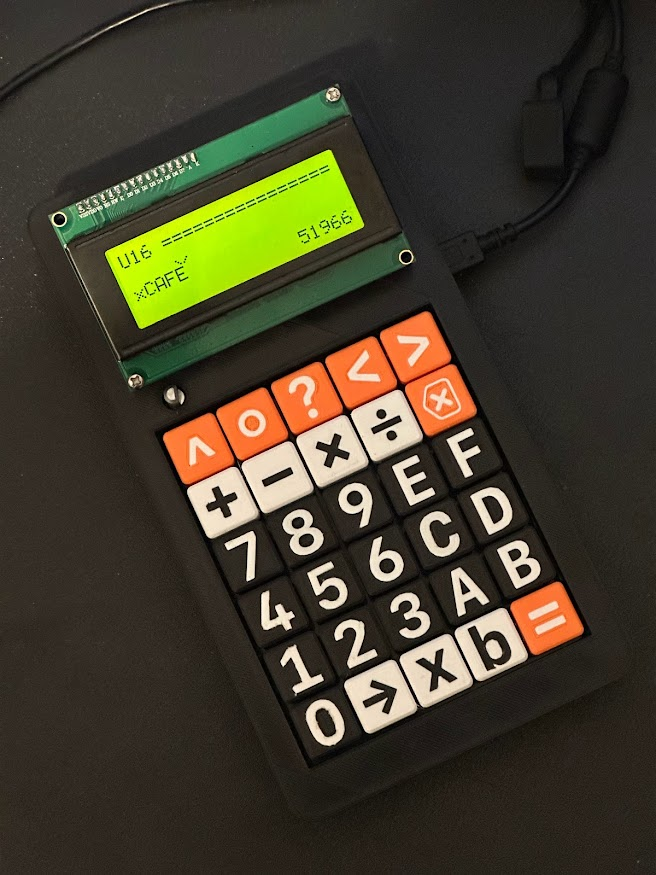

# Delta Radix

**[Try it online!](https://aaronc81.github.io/delta-radix/)**

The Delta Radix is a desktop calculator designed specifically to be useful for binary and
hexadecimal calculations.

Notable features:

- Mixed binary, hexadecimal, and decimal calculations
- Customisable bit width of arithmetic type (not limited to powers of 2!)
- Support for signed and unsigned data types
- Accurate simulation of overflow 
- Mechanical keyswitches for input

## Software

This repository is a Cargo workspace comprising a handful of crates. These are:

- `delta-radix-os` - The user-facing calculator software, 100% hardware-agnostic
- `delta-radix-hal` - Traits which the OS uses to interact with hardware (keypad, display, etc)
- `delta-radix-hal-pico` - Implementation of HAL traits for the Raspberry Pi Pico
- `delta-radix-hal-sim` - Implementation of HAL traits for a simulator which runs in the terminal
- `delta-radix-hal-web` - Implementation of HAL traits for a browser-based simulator with WebAssembly
  (build with `wasm-pack build --target web`, then visit `index.html`)
- `flex-int` - Arbitrary-precision arithmetic library used by the OS

The HAL implementations are the executable targets which should be flashed/run.

## Hardware

`hardware/` contains a KiCad schematic and PCB design.

`cad/` contains a 3D-printable case which the PCB can be mounted into, and keycaps for the switches.

## Usage

**Note:** Arithmetic parsing is incomplete! While they are implemented in the arithmetic library,
there's no way to input operations other than addition yet.

Base specifiers can appear on either site of a number (`xCAFE` or `CAFEx`), whichever you prefer. A
number without a base specifier is always interpreted as a decimal.

To change the result base, press the Format Select (`->`) key and then the base you'd like. Press
the Format Select key twice to return to decimal.

To change the arithmetic data type, use the Menu key. Enter a number of bits, and use the `+`/`-`
keys to choose signed or unsigned respectively.

Shift > Menu shows a menu of meta options, such as entering the bootloader.

## Things left to do

- [X] Faster parsing mode for constant overflow warnings
  - Parsing is slow, largely because of `FlexInt::from_unsigned_decimal_string` 
  - Wouldn't be a problem for evaluation, but is annoying during editing (key-press lag)
  - Either add a faster overall parsing mode just for constant overflow warnings, or versions of 
    number parsing which aren't suitable for evaluation but are fine for warnings (e.g. just use
    built-in Rust parsing, don't calculate overflow)
- [X] "Clear" key (shift + del?)
- [ ] Variables
- [X] Parentheses
- [X] Scrolling expression input
- [ ] Show result as if unsigned
- [X] Sleep after inactivity
